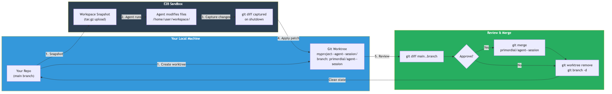

# Workspace Isolation

When you run an agent from inside a git repo, Primordial can share your code with the agent so it can read, analyze, and modify it. The agent works on an isolated copy — your working directory stays untouched until you review and merge the changes.

## How It Works



```
Your repo (main)                    E2B Sandbox
┌──────────────┐    snapshot     ┌──────────────────┐
│ src/          │ ──────────────>│ /home/user/       │
│ tests/        │   (tar.gz)    │   workspace/      │
│ ...           │               │     src/          │
└──────┬───────┘               │     tests/        │
       │                        │     ...           │
       │                        └────────┬─────────┘
       │                                 │
       │  worktree                       │ agent works
       v  (branch)                       v here
┌──────────────┐    git diff     ┌──────────────────┐
│ repo--agent-- │ <──────────────│ git diff against  │
│   session/   │   (patch)      │ initial snapshot  │
└──────────────┘                └──────────────────┘
```

1. **Snapshot** — Your repo is tar.gz'd (including uncommitted changes) and uploaded to the sandbox at `/home/user/workspace/`
2. **Agent works** — The agent reads, modifies, runs tests, commits — all inside the sandbox
3. **Patch extracted** — On shutdown, a `git diff` against the initial snapshot captures all changes
4. **Applied to worktree** — The patch is applied to an isolated git worktree and committed to a branch

Your `main` branch is never modified. You review the branch and merge when ready.

## Automatic Activation

Workspace sharing activates automatically when **both** conditions are met:

1. The agent's manifest declares `permissions.filesystem.workspace` as `readonly` or `readwrite`
2. You run the agent from inside a git repository

No flags needed. If the agent doesn't request workspace access, or you're not in a git repo, no workspace is shared.

## Git Worktree Isolation

Each agent run gets its own [git worktree](https://git-scm.com/docs/git-worktree) — a separate working directory with its own branch, sharing the same `.git` database as your repo.

### Naming

```
Directory:  {repo}--{agent}--{session}/
Branch:     primordial/{agent}--{session}
```

For example, running `perf-optimizer` with session `test-e2e`:
```
Directory:  myproject--perf-optimizer--test-e2e/
Branch:     primordial/perf-optimizer--test-e2e
```

The session name ensures multiple instances of the same agent get separate worktrees and branches.

### After the Agent Finishes

Primordial prints review commands when the agent completes:

```
Review:  git diff main..primordial/perf-optimizer--test-e2e
Merge:   git merge primordial/perf-optimizer--test-e2e
Cleanup: git worktree remove ../myproject--perf-optimizer--test-e2e
```

### Managing Worktrees

```bash
# List all active worktrees
git worktree list

# See what the agent changed
git diff main..primordial/agent-name--session

# Merge changes into your branch
git merge primordial/agent-name--session

# Remove worktree when done
git worktree remove ../myproject--agent-name--session

# Delete the branch too
git branch -D primordial/agent-name--session
```

## Skipping Worktree Isolation

Use `--no-worktree` to skip worktree creation. The workspace snapshot is still uploaded to the sandbox, but the returned patch is applied directly to your working directory (with a confirmation prompt in interactive mode).

```bash
primordial run ./my-agent --no-worktree
```

This is useful when:
- You want changes applied directly to your current branch
- You're in a throwaway/scratch directory
- You prefer manual patch management

If `git apply` fails (e.g., your files changed while the agent was running), the patch is saved to `.agent-patch-{agent-name}.patch` for manual application.

## Workspace Permissions

Set in `agent.yaml`:

```yaml
permissions:
  filesystem:
    workspace: readwrite   # or "readonly" or "none"
```

| Value | Agent can read files? | Agent can modify files? | Patch returned? |
|-------|----------------------|------------------------|-----------------|
| `none` | No | No | No |
| `readonly` | Yes | No (filesystem is `chmod a-w`) | No |
| `readwrite` | Yes | Yes | Yes |

For agents that only need to analyze code, use `readonly`. For agents that implement changes, use `readwrite`.

## Troubleshooting

| Problem | Solution |
|---------|----------|
| "Failed to create worktree" | An old branch with a conflicting name exists. Run `git branch -D primordial/{agent}` to clean up. |
| Patch shows no changes | Agent may not have modified any files, or changes were identical to the baseline. |
| `git apply` fails | Files changed locally while agent ran. Patch saved to `.agent-patch-{name}.patch` — apply manually with `git apply --3way`. |
| No workspace shared | Check that `permissions.filesystem.workspace` is `readonly` or `readwrite` in the agent's manifest, and that you're in a git repo. |
| Worktree not cleaned up | Run `git worktree remove {path}` and `git worktree prune`. |
